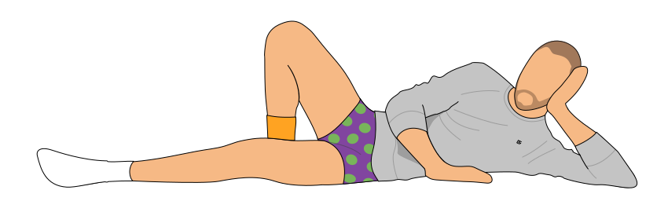
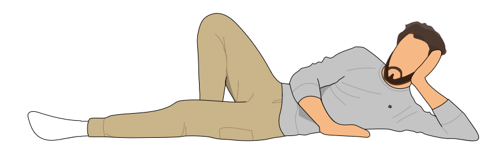
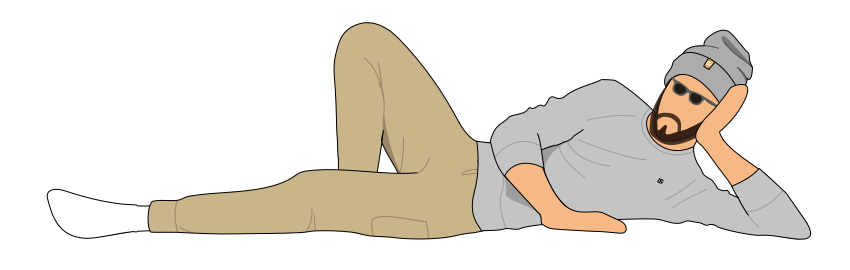

# me-generator
Generate an image with random pieces of clothing / cosmetics

**Note**: This generator is in alpha state, so any changes to the algorithm may occur until v1 is released. Specific seed will most likely not work reliably until then.

<table>
  <tr>
    <td></td>
    <td></td>
  </tr>
  <tr>
    <td></td>
    <td></td>
  </tr>
</table>
