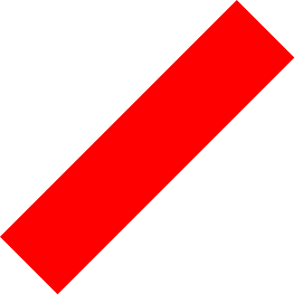
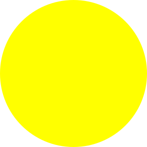

**Note**: This generator is in alpha state, so any changes to the algorithm may occur until v1 is released. Specific seeds will most likely not work reliably until then.

Syntax for defining rules are still work in progress. Changes may occur at any time.

# me-generator
Generate an image with random pieces of clothing / cosmetics.

<table>
  <tr>
    <td>
      <a href="https://generator.vladde.me/?seed=tacos"></a>
      <div align="center"><sub>seed: tacos</sub></div>
    </td>
    <td>
      <a href="https://generator.vladde.me/?seed=salsa"></a>
      <div align="center"><sub>seed: salsa</sub></div>
    </td>
  </tr>
  <tr>
    <td>
      <a href="https://generator.vladde.me/?seed=guppy"></a>
      <div align="center"><sub>seed: guppy</sub></div>
    </td>
    <td>
      <a href="https://generator.vladde.me/?seed=hello"></a>
      <div align="center"><sub>seed: hello</sub></div>
    </td>
  </tr>
</table>
<div align="center">
  <sub>

Examples generated using [this rulebook](https://github.com/vladdeSV/me-generator-images/blob/main/rulebook.json) from [vladdeSV/me-generator-images](https://github.com/vladdeSV/me-generator-images).

  </sub>
</div>

## Project
The projects consists of multiple parts:
- *Generator*, rulebook for how image should be combined
- *SVG combiner*, combines multiple `.svg` files into one

## Hack
Please keep in mind; in essence, this is a glorified SVG-combiner. An image is generated from a rulebook. This rulebook specifies the images which will be used, and all rules when generating the image.

I highly recommend looking at the [example rulebook](https://github.com/vladdeSV/me-generator-images/blob/9984c360b9590fecf7120bb100297d3b573190fc/rulebook.json), or [start a discussion](https://github.com/vladdeSV/me-generator/discussions).

### Examples

<table width="100%">
    <thead>
        <tr>
            <th>parts</th>
            <th></th>
            <th>output</th>
        </tr>
    </thead>
    <tbody>
        <tr>
            <td align="center">
                
                
                
                <br>
                
                
            </td>
            <td>
              <p align="center">
                <i>from <a href="./resource/examples/shapes/rulebook.json">shapes/rulebook.json</a></i>

```jsonc
{
  // ...
  "generation": [
    ["magenta", null],
    ["cyan", "red"],
    ["yellow", "green"]
  ]
}
```

</p>
            </td>
            <td align="center">
                <p>
                    <i>one of…</i>
                </p>
                
            </td>
        </tr>
        <tr>
            <td align="center">
                
                
            </td>
            <td>
              <p align="center">
                <i>from <a href="./resource/examples/z-index/rulebook.json">z-index/rulebook.json</a></i>

```jsonc
{
  // ...
  "indexes": [
    [
      "three",
      "under",
      "twelve#two"
    ]
  ]
}
```

</p>
            </td>
            <td align="center">
                
            </td>
        </tr>
    </tbody>
</table>

## Roadmap
Nothing is set in stone.
- [ ] Custom rules
   - [x] Custom part weight
   - [x] Part disallows some other part
   - [ ] Part require some other part
   - [x] Multi-layered parts, sandwich parts between *groups* of SVG
 - [ ] Target groups of parts

## Why
Have you heard of [*The Binding of Isaac: Rebirth*](https://store.steampowered.com/app/250900/The_Binding_of_Isaac_Rebirth/)?

## License
MIT © [Vladimirs Nordholm](https://github.com/vladdeSV)
